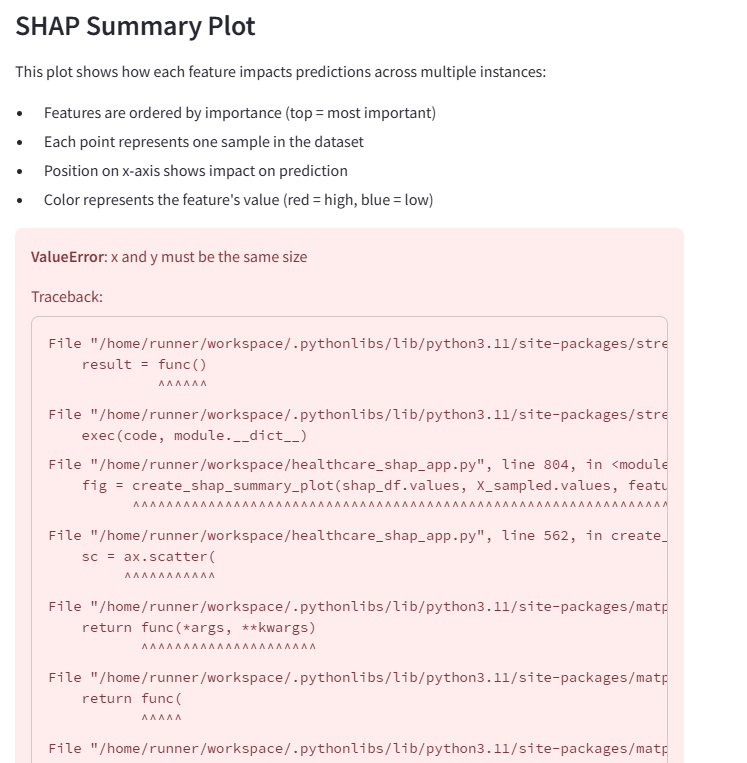

# Healthcare ML Explainer with SHAP Visualizations

A comprehensive Streamlit application for machine learning model interpretability, focusing on healthcare predictive modeling and advanced model explanation techniques.

## Overview

This application provides an educational interface for understanding how machine learning models make predictions in healthcare contexts. Using Shapley value-based explanations (SHAP), the app visualizes feature importance and model decisions in an intuitive way.



## Features

- **Healthcare Datasets**: Analysis of breast cancer and diabetes datasets
- **Data Exploration**: Comprehensive EDA tools and visualizations
- **Model Building**: Support for multiple ML algorithms including:
  - Logistic Regression
  - Random Forest
  - Gradient Boosting
- **Model Interpretation**:
  - SHAP summary plots (feature importance across all predictions)
  - Waterfall plots (individual prediction explanations)
  - Force plots (visual representation of model decision making)
- **Clinical Implications**: Insights on how model outputs can inform clinical decision making

## Installation

### Prerequisites
- Python 3.8+
- Git

### Setup Steps

1. Clone the repository
```bash
git clone https://github.com/yourusername/healthcare-shap-app.git
cd healthcare-shap-app
```

2. Create and activate a virtual environment
```bash
python -m venv venv
source venv/Scripts/activate  # On Windows with Git Bash
# OR
source venv/bin/activate      # On macOS/Linux
```

3. Install required packages
```bash
pip install streamlit pandas numpy matplotlib scikit-learn seaborn plotly eli5
```

## Usage

Run the Streamlit application:
```bash
streamlit run healthcare_shap_app.py
```

Navigate through the application using the sidebar menu:
1. **Introduction**: Overview of the project and machine learning interpretability
2. **Data Exploration**: Examine the dataset structure and characteristics
3. **Preprocessing**: Configure and apply data preprocessing steps
4. **Model Training**: Select and train machine learning models
5. **Evaluation**: Review model performance metrics
6. **SHAP Explanations**: Visualize model predictions and feature importance

## Project Structure

```
├── healthcare_shap_app.py   # Main Streamlit application
├── data_loader.py           # Dataset loading utilities
├── preprocessing.py         # Data preprocessing functions
├── model.py                 # Model selection and training
├── evaluation.py            # Model evaluation metrics
├── explanation.py           # SHAP visualization functions
├── utils.py                 # Helper utilities
├── .streamlit/              # Streamlit configuration
│   └── config.toml          # Streamlit server settings
└── models/                  # Saved model files (gitignored)
```

## SHAP Visualizations

This application includes several types of SHAP-inspired visualizations:

1. **Summary Plots**: Show how features impact predictions across multiple instances
2. **Bar Plots**: Rank features by their overall importance
3. **Waterfall Plots**: Explain individual predictions by showing each feature's contribution
4. **Force Plots**: Visualize the push/pull effect of features on a specific prediction

## How It Works

The application implements custom SHAP-like visualizations using a Monte Carlo sampling approach:

1. **Shapley Value Calculation**: Features are permuted to calculate their marginal contribution to predictions
2. **Visualization**: Matplotlib-based plots show feature importance and interactions
3. **Interpretation**: Contextual explanations help translate mathematical insights into clinical understanding

## Contributing

Contributions are welcome! Please feel free to submit a Pull Request.

## License

This project is licensed under the MIT License - see the LICENSE file for details.

## Acknowledgments

- Scikit-learn for machine learning algorithms
- Streamlit for the interactive web interface
- The SHAP paper and concept by Lundberg and Lee